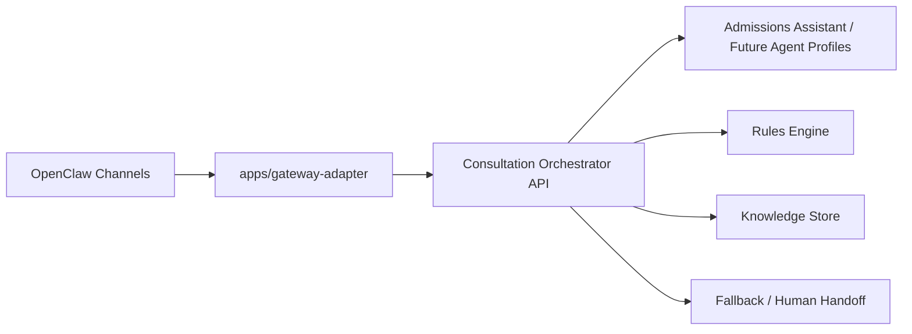
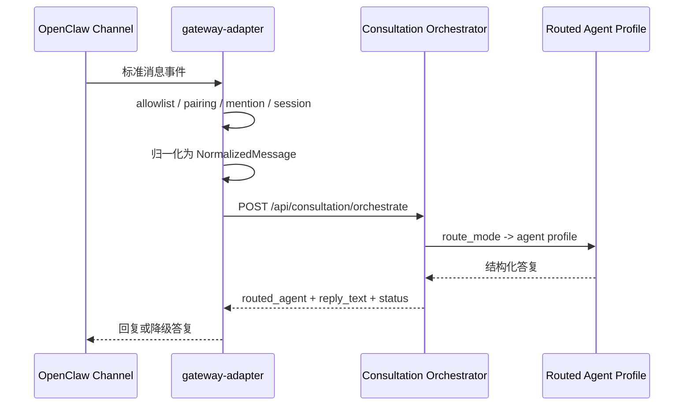

# OpenClaw Gateway 集成架构

## 1. OpenClaw 在本项目中的角色

OpenClaw 在本项目中只承担以下职责：

1. 消息入口
2. 渠道路由与通道控制
3. 访问控制与配对校验
4. 会话隔离
5. 审计日志
6. 标准降级

OpenClaw 不承担以下职责：

1. 不直接实现招生业务规则
2. 不直接访问知识库、规则库或底层数据库
3. 不在渠道插件中写死招生判断
4. 不绕过统一 adapter 直连业务服务

最终边界如下：



## 2. 组件边界

### `apps/gateway-adapter`

职责：

- 接收 OpenClaw 标准消息事件
- 校验共享令牌、allowlist、pairing
- 归一化为 `NormalizedMessage`
- 生成 session key
- 根据发送者角色和 channel binding 选择 route mode
- 转发到 `Consultation Orchestrator`
- 记录审计日志
- 在后端异常时返回标准降级回复

不做：

- 不解析招生政策
- 不读取知识库文件
- 不决定最终业务结论

### `Consultation Orchestrator API`

当前接口：

- `POST /api/consultation/orchestrate`

职责：

- 接收 `NormalizedMessage`
- 根据 `route_mode` 决定 agent profile
- 统一调用业务咨询能力
- 返回结构化响应给 gateway-adapter

## 3. 启动方式

### 启动咨询服务（Orchestrator 所在服务）

```powershell
python -m uvicorn app.server:app --host 127.0.0.1 --port 8000
```

### 启动 OpenClaw Gateway Adapter

```powershell
$env:OPENCLAW_GATEWAY_CONFIG="C:\Users\Administrator\myproj\2024\config\openclaw.sample.json"
python apps/gateway-adapter/main.py
```

默认监听：

- `http://127.0.0.1:8010/health`
- `http://127.0.0.1:8010/events/openclaw`

## 4. 标准消息流



## 5. 路由模式

### 家长咨询模式

- `route_mode = parent_consultation`
- 默认模式
- 路由到 `admissions-consultation`

### 单位管理员模式

- `route_mode = organization_admin`
- 由 sender role tag 或专用 binding 触发
- 优先路由到 `organization-review-process`

### 运营 / 人工客服模式

- `route_mode = operations_support`
- 由 sender role tag 或专用 binding 触发
- 路由到 `operations-console`

## 6. 消息类型支持

### 已支持

- `text`
- `image` 附件元数据
- `document` 附件元数据

### 预留

- `voice`

当前 `voice` 只保留附件元数据并返回“请补充文字”型响应，不在 gateway 层做转写。

## 7. 安全配置

安全默认值如下：

1. `defaultDeny = true`
2. 必须配置 `allowlist.channels`
3. 默认要求共享令牌 `X-OpenClaw-Token`
4. `pairing.required = true`
5. 群聊默认 `requireMention = true`
6. 默认 `perSenderSession = true`
7. 降级时统一转 `fallbackAgent`

## 8. 审计日志

Gateway 会按 JSON line 输出以下审计事件：

1. `incoming_message`
2. `normalized_message`
3. `routed_agent`
4. `response_status`

关键字段：

- `request_id`
- `channel`
- `binding`
- `session_key`
- `route_mode`
- `routed_agent`
- `response_status`
- `degradation_code`
- `escalation`

## 9. 生产建议

1. 共享令牌不要使用 sample 默认值
2. `allowlist.senders` 和 `allowlist.peers` 在生产应逐步收紧
3. `trustedSenders` 仅保留运营后台和人工客服入口
4. 通过日志系统收集 `response_status=degraded` 的比例
5. 不要让任何渠道插件直接访问知识库或数据库
