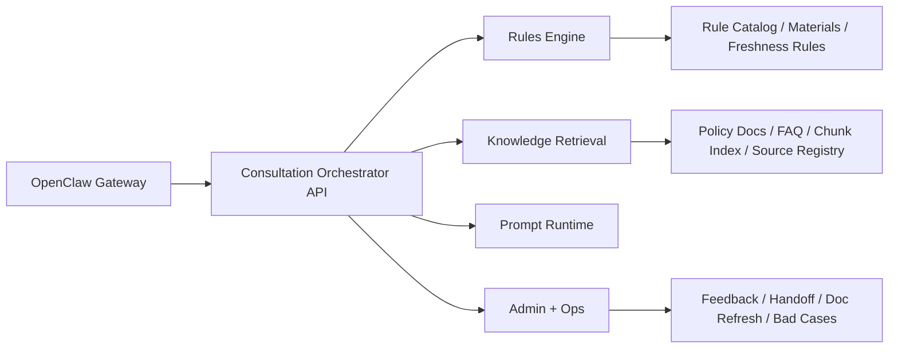

# 系统蓝图

## 方案摘要

目标系统是一个面向招生咨询的规则优先、证据优先、人工兜底优先的咨询平台，而不是自由聊天机器人。系统必须围绕官方政策文件、申请指南、平台操作指引、FAQ 和业务文档工作，并严格遵守以下底线：

- 不凭猜测给出招生资格结论。
- 不把历史文件伪装成当前最新政策。
- 回答顺序固定为：先判断类别，再解释依据，再给报名或操作步骤。
- 低置信度、证据冲突、时效不明时不强答，直接补问或转人工。
- 所有关键结论必须绑定 `source_id / title / page / chunk_id`。

## 仓库扫描结论

当前仓库并非空仓，已有一版 Python 原型与资料资产：

- `app/`: FastAPI 服务、规则引擎、知识检索、OpenClaw 桥接原型。
- `scripts/build_knowledge.py`: 本地 PDF / DOCX / CSV 知识导入脚本。
- `scripts/run_openclaw_action.ps1`: OpenClaw 动作脚本。
- `data/seed/`: 初始规则种子与系统提示词。
- 根目录资料文件夹: 2024 年政策、申请指南、平台操作指引、FAQ。

这意味着当前最优路径不是推倒重来，而是先建立新工作区结构和统一 contracts，然后逐步迁移现有原型能力。

## 四层架构



### 1. OpenClaw Gateway 层

职责：

- 多渠道接入，统一收消息。
- 将所有入站消息转成 `NormalizedMessage`。
- 执行 `dm / group / admin` 三种会话策略。
- 执行 `pairing / allowlist / requireMention` 安全开关。
- 通过 `channel binding` 把不同渠道、群组、peer 路由到不同 `agent_profile`。
- 当编排服务不可用时返回标准降级话术，不允许自由生成。

非职责：

- 不做最终业务判断。
- 不直接做政策解释。
- 不在渠道层写死单一平台逻辑到核心编排中。

### 2. Consultation Orchestrator 层

职责：

- 意图识别与事实抽取。
- 生成/更新 `CaseProfile`。
- 命中规则分类。
- 调度检索。
- 组装带证据回答。
- 决定补问、转人工、降级、拒答。

关键约束：

- 分类与结论分离，先分类再给说明。
- 任何“资格已确认”类表述必须有充分证据链。
- 当分类不稳定、资料缺失、政策时效不明、证据冲突时，不输出强结论。

### 3. Knowledge + Rules 层

知识子层：

- 文档入库
- 切块与来源登记
- FAQ 管理
- 检索与证据排序
- 文档版本与时效风险标记

规则子层：

- A1/A2/A3/B1/B2/B3/C 分类骨架
- 特殊政策标签：优才卡、优粤卡、华侨华人、台湾学生、香港/澳门学童、积分入学
- 流程标签：房产锁定/解锁、资料修改、单位账号注册、单位管理员审核
- 材料清单
- 时效风险规则
- 人工复核触发规则

### 4. Admin + Ops 层

职责：

- 会话日志查看
- 人工兜底
- FAQ 维护
- 坏案例沉淀
- 文档更新提醒
- 反馈与质量回放

## 目标目录结构

```text
apps/
  gateway-adapter/
    config/
    src/
  api/
    src/
  web/
    src/

packages/
  knowledge/
    src/
  rules/
    src/
  shared/
    contracts.py

prompts/
  runtime/
  eval/
  repair/

evals/
  cases/
  scripts/
```

## 核心 schema

已落地在 [packages/shared/contracts.py](/C:/Users/Administrator/myproj/2024/packages/shared/contracts.py)：

- `NormalizedMessage`
  OpenClaw 与后端之间的统一入站消息结构，承载渠道信息、会话模式、发送者、文本、附件、mentions、安全路由和原始负载引用。
- `CaseProfile`
  单个咨询案例的事实快照，承载家长/单位/招生工作人员角色、学段、户籍、房产、特殊身份、单位账号状态、缺失字段和摘要。
- `ClassificationResult`
  编排服务输出的分类结果，含 A1/A2/A3/B1/B2/B3/C、意图、命中规则、缺失事实、风险和人工复核标记。
- `EvidenceHit`
  每条结论对应的证据切片，至少包含 `source_id / title / page / chunk_id`。
- `AnswerPayload`
  标准回答载荷，固定为“类别说明 -> 依据说明 -> 操作步骤”，并承载证据、风险、材料和追问。
- `EscalationDecision`
  补问/人工转接/系统降级决策对象，明确原因、目标队列、用户提示和 SLA 提示。

## OpenClaw 与咨询服务消息流

1. OpenClaw 收到渠道消息。
2. Gateway 根据渠道配置读取 `channel binding`。
3. Gateway 执行安全检查：
   - 是否在 allowlist 内
   - 群聊是否需要 `@mention`
   - 当前会话是否已配对
4. Gateway 把原始消息转成 `NormalizedMessage`。
5. Gateway 将 `NormalizedMessage` 发送给 Consultation Orchestrator。
6. Orchestrator 更新或创建 `CaseProfile`。
7. Orchestrator 运行分类规则，得到 `ClassificationResult`。
8. Orchestrator 调用 Knowledge 检索，得到 `EvidenceHit` 列表。
9. Orchestrator 生成 `AnswerPayload` 或 `EscalationDecision`。
10. Gateway 将结果渲染为渠道输出格式：
    - 正常回答：按固定结构返回
    - 低置信度：补问或转人工
    - 服务异常：返回标准降级模板

## 数据库设计

数据库初版建议使用 PostgreSQL。具体 DDL 见 [docs/postgres-schema.sql](/C:/Users/Administrator/myproj/2024/docs/postgres-schema.sql)。

核心表分为五组：

### 知识与规则

- `knowledge_source`
- `knowledge_chunk`
- `faq_entry`
- `rule_set`
- `rule_clause`

### 路由与渠道

- `agent_profile`
- `channel_binding`

### 会话与案例

- `consultation_session`
- `consultation_message`
- `case_profile`
- `classification_run`
- `answer_trace`

### 人工兜底与运营

- `escalation_ticket`
- `feedback_event`
- `source_refresh_alert`

### 设计原则

- 知识源、切片、规则版本必须可追溯。
- 会话消息与分类结果分表存，避免把审计链压进单表 JSON。
- 允许一个会话下多次分类运行与多次回答生成。
- 允许一个案例在低置信度下升级成多个运营动作。

## 线程拆分

### 线程 1：Gateway Adapter

目标：

- OpenClaw 入站协议
- `NormalizedMessage` 适配
- 安全开关
- 降级回包

依赖：

- `packages/shared`

### 线程 2：Consultation API

目标：

- Orchestrator API
- 分类流程
- 规则与检索编排
- `AnswerPayload` / `EscalationDecision`

依赖：

- `packages/shared`
- `packages/rules`
- `packages/knowledge`

### 线程 3：Knowledge Pipeline

目标：

- 文档导入
- 切块
- 来源登记
- 检索接口
- 时效标记

依赖：

- `packages/shared`

### 线程 4：Rules Engine

目标：

- A/B/C 分类矩阵
- 特殊政策规则
- 材料清单
- 风险和时效规则

依赖：

- `packages/shared`

### 线程 5：Web + Admin

目标：

- 家长咨询页
- 会话列表
- 人工转接工作台
- FAQ / 坏案例管理

依赖：

- `apps/api`
- `packages/shared`

### 线程 6：Eval + Ops

目标：

- 评测样本
- 红队脚本
- 文档更新提醒
- 回归门禁

依赖：

- `packages/shared`
- `apps/api`

## 现在最适合并行启动的线程

依赖最少、收益最高的并行顺序：

1. `packages/shared`: 冻结 contracts，避免后续各线程各写一套 schema。
2. `apps/gateway-adapter`: 建好 NormalizedMessage 入口与标准降级回包。
3. `packages/knowledge`: 把现有资料导入逻辑从 `scripts/build_knowledge.py` 迁出。
4. `packages/rules`: 搭建分类矩阵、特殊政策标签、时效判断骨架。
5. `apps/api`: 在 shared / rules / knowledge 稳定后接编排服务。
6. `apps/web`: 最后连 API 做页面与运营后台。

## 主要风险

1. A1/A2/A3/B1/B2/B3/C 的官方定义、适用条件、优先级若未被准确抽取，会直接影响分类稳定性。
2. 当前仓库资料以 2024 年为主，若直接用于“最新政策”回答，存在明显时效风险。
3. 单位账号注册、单位管理员审核、房产锁定/解锁这类流程性问题，往往跨文档、跨系统，规则与知识库都需要单独建模。
4. 群聊场景如果不严控 `requireMention` 和 allowlist，极易导致误触发或串话。
5. Web 后台若不把证据链、分类结果、补问理由可视化，人工兜底会很快失效。

## 尚未决定但必须后续处理的点

1. 目标运行时栈是否统一为 Python，还是网关/API/Web 分别采用不同技术栈。
2. 是否引入向量数据库，还是先用本地索引 + PostgreSQL 混合方案。
3. 2025/2026 官方材料的采集渠道、更新频率和刷新门禁。
4. A/B/C 分类的正式规则来源和版本管理机制。
5. 人工转接的实际队列系统，是内置后台、飞书工单，还是 OpenClaw 管理通道。
6. 是否需要 PII 脱敏与审计导出能力。
